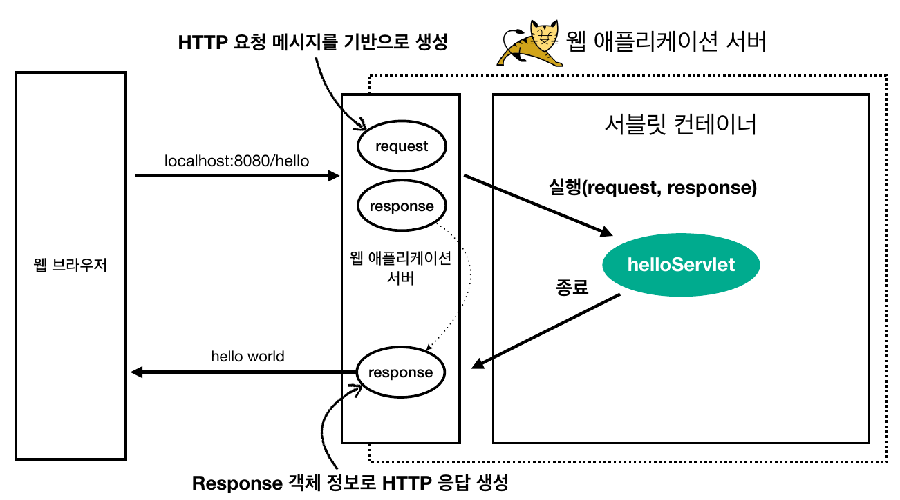
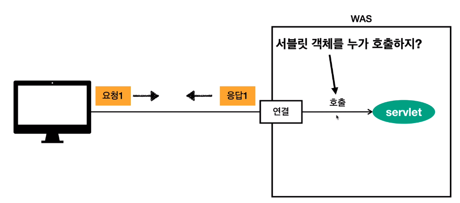

# spring-mvc


## 2021.10.18


## 웹 애플리케이션 이해


###  백엔드 웹 기술 어려운 이유

1. HTTP

2. 백엔드 역사가 너무 오래됨(20년)
   - 자동화되고, 추상화됨
   - 과거의 문맥을 이해하기 어려움

3. 스프링 MVC
   - 너무 많은 기능을 제공

---


### 서블릿

- 서블렛은 **소켓 연결**이나 **HTTP 메시지 파싱**, **멀티 스레드**와 같은 반복적이고 어려운 작업을 대신 해줌
- 덕분에 개발자는 **HTTP 스펙**을 매우 편리하게 사용할 수 있음

- 예시

  ```java
  @WebServlet(name = "helloServlet", urlPatterns = "/hello")
  public class HelloServlet extends HttpServlet {
      @Override
      protected void service(HttpServletRequest request, HttpServletResponse response){
          // 애플리케이션 로직
      }
  }
  ```



- 그림출처: 김영한- 스프링 MVC 1편 - 백엔드 웹 개발 핵심 기술 강의자료 


## 서블릿 컨테이너

- 정의

  - 서블릿을 지원하는 WAS 
    - ex) WAS

- 역할

  - 서블릿 객체를 `생성, 초기화, 호출, 종료` 하는 생명주기 관리

  - 서블릿 객체는 싱글톤으로 관리
    - 공유 변수 사용 주의

  - **동시 요청을 위한 멀티 쓰레드 처리지원**


### 동시 요청 - 멀티 쓰레드



- 그림출처: 김영한- 스프링 MVC 1편 - 백엔드 웹 개발 핵심 기술 강의자료 


#### 요청 마다 쓰레드 생성

- 단점
  - 쓰레드 생성 비용이 비싸다.
    - 요청이 올 때마다 생성하면, 응답 속도가 늦어진다.
  - **컨텍스트 스위칭** 비용이 발생한다.
  - 생성에 제한이 없다.
    - 요청이 너무 많이 오면, CPU, 메모리 임계점을 넘어서 서버가 죽을  수 있음


#### 쓰레드 풀

- 쓰레드 생성 제한이 없어서 발생하는 문제점을 해결하기 위해서 보통 WAS에는 생성가능한 쓰레드의 최대치를 두는 **쓰레드 풀**이 구성돼있음
- 쓰레드를 계속 생성하는 게 아니라, 미리 만들어두고 요청마다 빌려주는 형식

- 쓰레드풀에서 제공하는 쓰레드 개수 이상의 요청이 올 경우, 해당 요청을 **대기 혹은 거절**할 수 있음
- 톰켓의 쓰레드 풀은 최대 200개 기본 설정


#### WAS의 주요 튜닝 포인트 - 최대 쓰레드 수

- 너무 낮게 설정하면
  - 동시 요청이 많아질 때, 서버 리소스는 여유롭지만, 클라이언트는 금방 응답 지연
- 너무 높게 설정하면
  - 동시 요청이 많아질 때, CPU, 메모리 임계점 초과로 서버 다운

- 적정 숫자는
  - 애플리케이션 로직의 복잡도, CPU, 메모리, IO 리소스 상황에 따라 모두 다름
  - 성능 테스트를 해봐야함


### 핵심: WAS의 멀티 스레드 지원

- 개발자는 마치 싱글 쓰레드 프로그래밍을 하듯이 편리하게 소스 코드를 개발
  - 생산성 향상
- 멀티 쓰레드 환경이므로 싱글톤 객체(서블릿, 스프링 빈)는 주의해서 사용
  - 공유변수 조심


## HTML, HTTP API, CSR, SSR


### HTTP API

- 데이터만 주고 받음
- UI 화면이 필요하면, 클라이언트가 별도 처리


### SSR(서버 사이드 렌더링)

- 서버에서 최종 HTML을 생성해서 클라이언트에 전달
- 주로 정적인 화면에 사용
- 관련기술: JSP, 타임리프

**스프링 MVC 1편 - 백엔드 웹 개발 핵심 기술**

### CSR(클라이언트 사이드 렌더링)

- HTML 결과를 자바스크립트를 사용해 웹 브라우저에서 동적으로 생성해서 적용
- 주로 동적인 화면에 사용
  - ex) 구글 지도, Gmail, 구글 캘린더
- 관련기술: React, Vue.js -> **웹 프론트엔드 개발자**


### 최신 기술 - 스프링 웹 기술의 분화

- Web Servlet - Spring MVC
- Web Reactive - Spring WebFlux
  - 비동기, 함수형, 기술적 난이도 높음, 실무에서 아직 사용 X
  - servlet이 아닌 netty 사용


### 자바 뷰 템플릿 역사

- HTML을 편리하게 생성하는 뷰 기능

- JSP
  - 속도 느림, 기능 부족

- 프리마커, 벨로시티
  - 속도 문제 해결, 다양한 기능
- 타임리프
  - 내추럴 템플릿 : HTML의 모양을 유지하면서 뷰 템플릿 적용 가능
  - 스프링 MVC와 강력한 기능 통합
  - **최선의 선택**, 단 성능은 프리머커, 벨로시티가 더 빠름


---


## 2021.10.19(화)


## 서블릿


```java
@WebServlet(name = "helloServlet", urlPatterns = "/hello")
public class HelloServlet extends HttpServlet {
    @Override
    protected void service(HttpServletRequest request, HttpServletResponse response) throws ServletException, IOException {
        System.out.println("HelloServlet.service");
        System.out.println("request = " + request);
        System.out.println("response = " + response);
    }
}
```

- HttpServletRequest, HttpServletResponse 는 인터페이스
- 톰켓이나 제티 같은 여러 WAS 서버들이 서블릿 표준 스펙에 맞춰서 구현함


### HttpServletRequest 역할

HTTP 요청 메시지를 개발자가 직접 파싱해서 사용해도 되지만, 매우 불편

서블릿은 개발자가 HTTP 요청 메시지를 편리하게 사용할 수 있도록 개발자 대신에 HTTP 요청 메시지를 파싱한다. 

그리고 그 결과를 HttpServletRequest 객체에 담아서 제공한다.


- 임시 저장소 기능
- 세션 관리 기능


#### 복수 파라미터에서 단일 파라미터 조회

- request.getParameter() 는 하나의 파라미터 이름에 대해서 단 하나의 값만 있을 때 사용해야 한다.
- 중복일 때는 request.getParameterValues() 를 사용해야 한다.
- 참고로 이렇게 중복일 때 request.getParameter() 를 사용하면 request.getParameterValues() 의
  첫 번째 값을 반환한다.

```java
System.out.println("이름이 같은 복수 파라미터 조회");
String[] usernames = request.getParameterValues("username");

//http://localhost:8080/request-param?username=hello&age=20&username=h
for (String name : usernames) {
    System.out.println("username"+":"+name);
}
```


### HttpServletResponse 역할

- HTTP 응답 메시지 생성

- HTTP 응답코드 지정

- 헤더 생성

- 바디 생성
- 편의 기능 제공
  - Content-Type, 쿠키, Redirect
  - Content-Length 생략시 자동으로 바디 길이 계산해서 보내줌


### HTTP 응답 데이터 - 단순 텍스트, HTML

- 단순 텍스트 응답
- HTML 응답
- HTTP API - MessageBody JSON 응답
